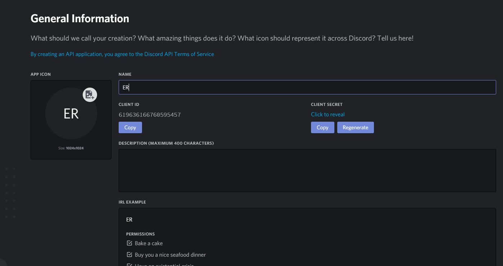

# Helixus

> Helixus is a multifunction bot available in some languages !

## Installation

Since the bot is open-source, you can have your own instance of Helixus.

You must have **NPM, Git, NodeJS, MySQL (or MariaDB) and FFmpeg** installed on your system.

### Windows

1. Clone this repository
   * Execute `git clone https://github.com/aliciacactus/HelixusV2.git --branch master`
2. Create the tables for MySQL (or MariaDB) with the `table_create.sql` file in the `db` folder.
3. You need to execute these commands in the folder in which you cloned Helixus :
   * `npm -g --add-python-to-path install windows-build-tools node-gyp`
   * `npm i --global --production windows-build-tools`
   * `npm install`
4. You now have a folder called `node_modules`. This folder is where your packages are installed.
5. Rename the `config.example.json` to `config.json` and replace every infos (your token, your db password, etc..)
6. You can now run the bot by using the command `node manager.js`

To invite the bot on your server :
1. Copying the client ID of your bot application that you can find [**here**](https://discordapp.com/developers/applications/) :

2. Generate an invite link using the Client ID [**here**](https://discordapi.com/permissions.html).

### Linux (Debian based)

1. Clone this repository
   * Execute `git clone https://github.com/aliciacactus/HelixusV2.git --branch master`
2. Create the tables for MySQL (or MariaDB) with the `table_create.sql` file in the `db` folder.
3. You need to execute these commands in the folder in which you cloned Helixus :
   * `$ sudo apt-get install build-essential`
   * `$ sudo apt-get install libcairo2-dev libjpeg-dev libpango1.0-dev libgif-dev build-essential g++`
   * `$ npm install`
4. You now have a folder called `node_modules`. This folder is where your packages are installed.
5. Rename the `config.example.json` to `config.json` and replace every infos (your token, your db password, etc..)
6. You can now run the bot by using the command `node manager.js`

To invite the bot on your server :
1. Copying the client ID of your bot application that you can find [**here**](https://discordapp.com/developers/applications/) :

2. Generate an invite link using the Client ID [**here**](https://discordapi.com/permissions.html).